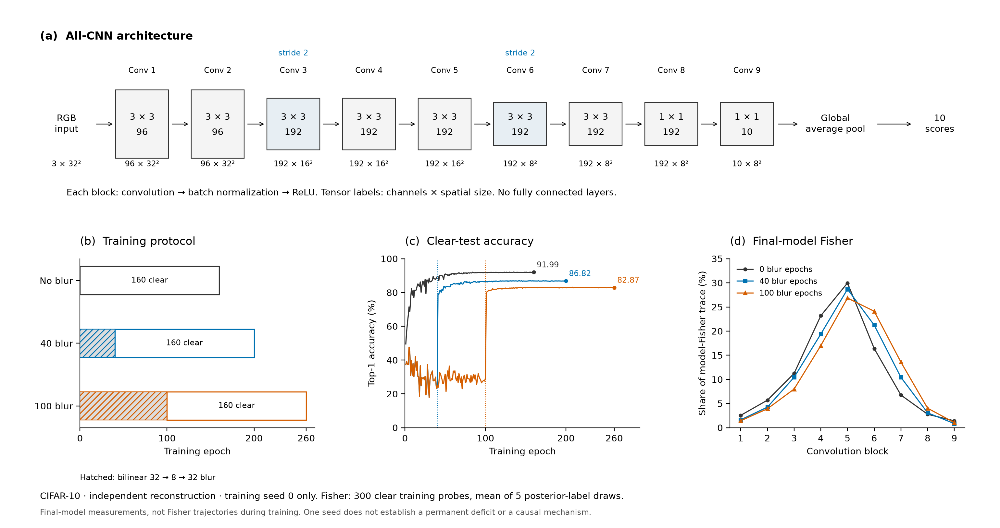
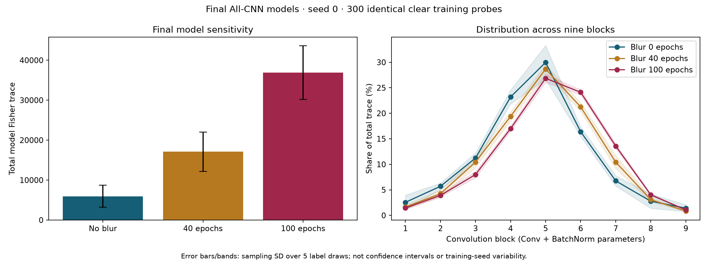

# Critical learning periods

**Does early blurry vision leave a lasting mark on a neural network?**

A small, typed Python reconstruction of the CIFAR-10 experiment in
[Critical Learning Periods in Deep Networks](https://arxiv.org/abs/1711.08856)
(Achille, Rovere & Soatto, ICLR 2019). Train on blurry images, restore clear images,
and compare final accuracy and layer-wise weight sensitivity.



**Figure 1.** (a) Nine convolution blocks and global average pooling.
(b) Initial blur followed by 160 clear epochs. (c) Clear-test accuracy; dotted
lines mark blur removal. (d) Mean layer-wise share of final-model Fisher trace.
All curves use the committed seed-0 measurements.
[Vector PDF](docs/architecture.pdf) · [SVG](docs/architecture.svg) ·
[Figure source](docs/diagram.py) (`uv run python docs/diagram.py`).

This is **our documented reconstruction, not the authors' original code**.
The included results cover one completed training seed. They are preliminary,
not a claim that every result or proposed mechanism in the paper has been replicated.

## All-CNN is not an MLP

**All-CNN** means *all-convolutional neural network*. Convolutions share filters
across spatial positions, preserving image structure. An **MLP** mainly uses
fully connected layers, typically operating on a flattened image.

Here nine Conv → BatchNorm → ReLU blocks produce ten class feature maps.
Global average pooling turns those maps into ten scores. There is no fully
connected classifier and no ResNet-style skip connection. Cross entropy takes
these scores directly; softmax is used when probabilities are needed.

## Why this experiment?

The question is whether **when** clean information arrives matters, even when
all models eventually receive the same amount of clear-image training.

| Condition | Blurred training | Clear training | Total epochs |
|---|---:|---:|---:|
| Baseline | 0 | 160 | 160 |
| Earlier removal | 40 | 160 | 200 |
| Later removal | 100 | 160 | 260 |

Fisher information adds a second question: do the resulting models distribute
prediction sensitivity differently across their layers? It is a measurement,
not a training objective or a count of stored bits.

## Quick start

Requires Python 3.11+ and [uv](https://docs.astral.sh/uv/). An accelerator is
practical for the full experiment; CPU works for tests and measurement. Device
selection prefers CUDA, then Apple MPS, then CPU. A one-epoch local MPS measurement
suggested roughly 41 hours for nine runs; this is hardware-dependent, not a promise.

```sh
git clone https://github.com/RoniLeor/critical-learning-periods.git
cd critical-learning-periods
uv sync --locked
uv run pytest -q

# Downloads and verifies CIFAR-10; saves clear and blurred tensors.
uv run python -m clp.prepare --data data/cifar10

# Timing only; benchmark results must be kept separate from study results.
uv run python -m clp.train --data data/cifar10 --out runs/benchmark --benchmark

# Start with one seed; rerunning this command resumes the latest checkpoint.
uv run python -m clp.train --data data/cifar10 --out runs/study --seeds 0

# Complete the planned three-seed comparison.
uv run python -m clp.train --data data/cifar10 --out runs/study --seeds 0 1 2
uv run python -m clp.report --results runs/study

# Final-model Fisher comparison, once all three seed-0 runs are complete.
uv run python -m clp.analyze --data data/cifar10 --results runs/study --out runs/fisher
```

Add `--device cpu`, `--device mps`, or `--device cuda` to training when needed.
No cloud service, credentials, experiment tracker, or paid API is required.
Keep data and checkpoints local; they are ignored by Git. Do not launch two
training processes into the same output directory.

## Measured results: seed 0 only

All three models received 160 clear training epochs. Accuracy uses the full
10,000-image clear test split; Fisher uses 300 identical clear training probes.

| Initial blur | Final accuracy | Mean model-Fisher trace | Relative trace |
|---|---:|---:|---:|
| None | 91.99% | 5,941 | 1.0× |
| 40 epochs | 86.82% | 17,123 | 2.9× |
| 100 epochs | 82.87% | 36,870 | 6.2× |



These endpoints show lower accuracy and higher measured weight sensitivity after
longer early blur. They do not prove permanent damage or a causal Fisher mechanism.
Trace estimates are noisy: sampling standard deviations are approximately 2,768,
4,928 and 6,723, respectively. Bands are label-sampling variation, not uncertainty
across training seeds. Middle blocks remain important in all three models.

The direct Fisher estimator here differs from the paper's All-CNN variational
approximation. See [protocol and limitations](docs/protocol.md) and
[raw results](results/seed0/) before interpreting the plots.

## Small codebase

| File | Responsibility |
|---|---|
| `src/clp/core.py` | Architecture, blur, augmentation, schedule, epoch, checkpoint |
| `src/clp/prepare.py` | Official data download, checksums and split audit |
| `src/clp/train.py` | Training, benchmark and resume |
| `src/clp/metrics.py` | Batched evaluation |
| `src/clp/fisher.py` | Per-example model-Fisher trace |
| `src/clp/analyze.py` | Paired final-model Fisher comparison |
| `src/clp/report.py` | Accuracy curves and progress report |
| `tests/checks.py` | Architecture, schedules, transforms, state integrity and analytic Fisher |

```sh
uv run ruff check .
uv run ty check
uv run pyright
uv run pytest -q
```

## Reference

Alessandro Achille, Matteo Rovere, Stefano Soatto. **Critical Learning Periods in
Deep Networks.** ICLR 2019. [Paper](https://arxiv.org/abs/1711.08856) ·
[Experimental details](https://arxiv.org/html/1711.08856v3#A1)

Code and original repository figures: [MIT](LICENSE). CIFAR-10 is downloaded from
its original distributor and is not included or relicensed by this repository.
