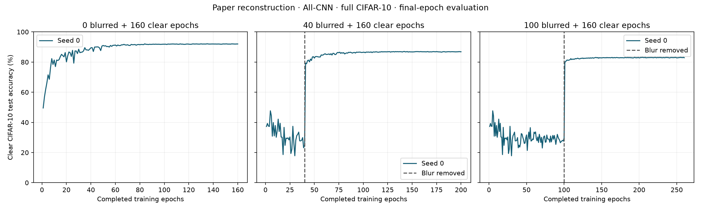

# Paper reconstruction results

Completed 3 of 9 planned runs. This is a documented reconstruction, not author code.

| Seed | Blurred epochs | Completed epochs | Final/current accuracy | Complete |
|---|---:|---:|---:|---|
| 0 | 0 | 160 | 91.99% | True |
| 0 | 100 | 260 | 82.87% | True |
| 0 | 40 | 200 | 86.82% | True |

See docs/protocol.md in the repository and config.json for source settings and reconstruction assumptions. Each condition receives 160 clear epochs. Test checkpoints were not selected or tuned. Three seeds describe training variability but do not establish permanent impairment.

Original paper: https://arxiv.org/html/1711.08856v3
